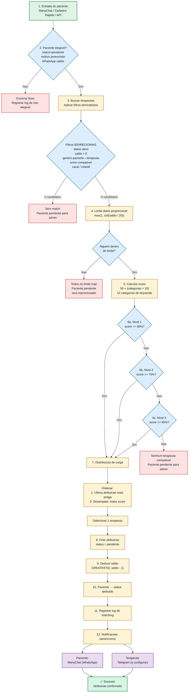
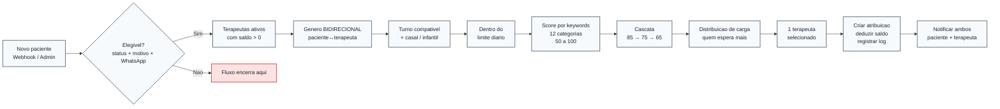
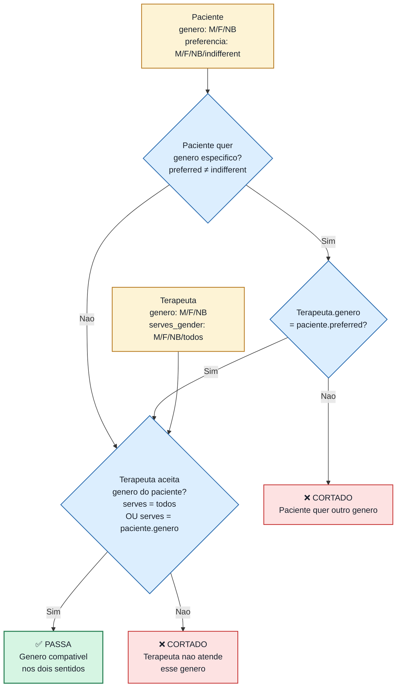
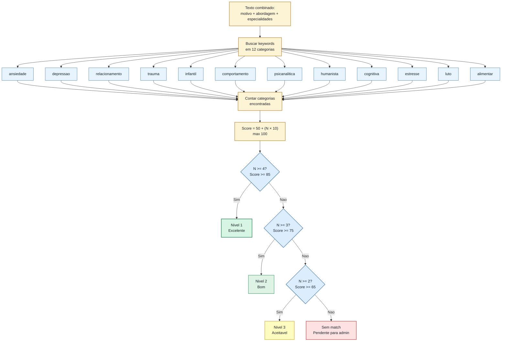
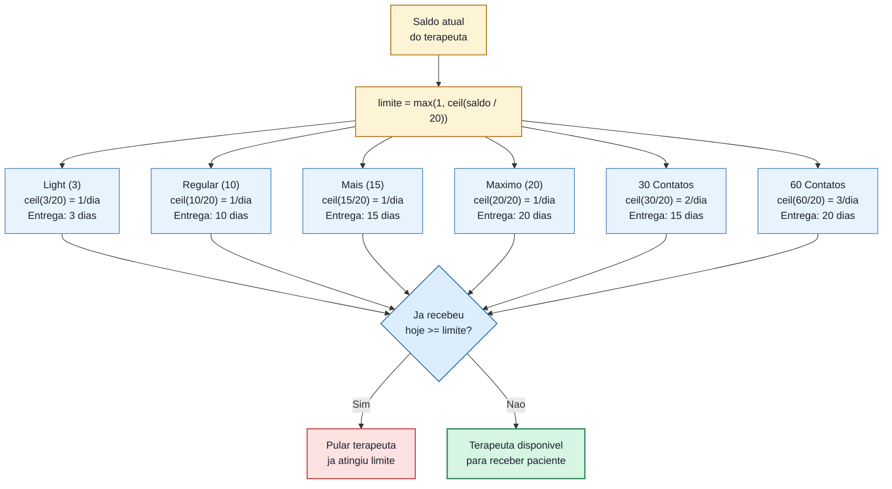
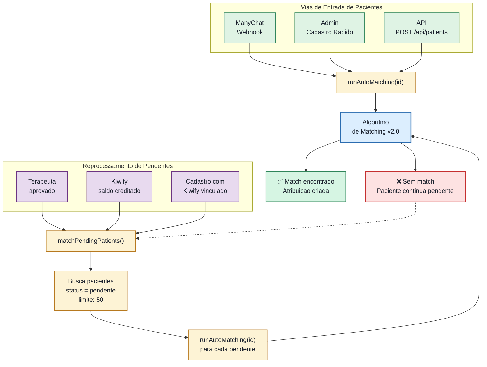

# Fluxograma Visual do Matching v2.0

Baseado em `MATCHING_DETALHADO_2_0.md`.

Se o seu preview de Markdown suportar Mermaid, os diagramas abaixo vao aparecer renderizados.

---

## 1. Fluxo Principal Completo

---

## 2. Visao em Funil

---

## 3. Detalhe: Filtro Bidirecional de Genero

---

## 4. Detalhe: Score e Cascata

---

## 5. Detalhe: Distribuicao Proporcional (Limite Diario)

---

## 6. Detalhe: Vias de Entrada e Reprocessamento

---

## 7. Onde o processo pode parar

| Passo | Motivo de parada | Recuperacao |
|-------|-----------------|-------------|
| 2 | Paciente nao elegivel (sem motivo/WhatsApp) | Admin corrige dados do paciente |
| 3 | 0 terapeutas nos filtros | Espera novo terapeuta ou admin flexibiliza |
| 4 | Todos no limite diario | Automatico: reprocessa no dia seguinte |
| 6 | Ninguem atinge 65% de score | Admin faz matching manual |
| 12 | Notificacao falha (ManyChat/Telegram) | Atribuicao ja criada, admin notifica manualmente |

---

## 8. Leitura Rapida

- O matching **nao comeca pela IA** — primeiro elimina terapeutas por regras obrigatorias bidirecionais
- O **limite diario proporcional** garante que pacotes grandes e pequenos sejam entregues de forma justa
- A **cascata 85→75→65** evita rejeitar matches aceitaveis sem forcar matches ruins
- A **distribuicao de carga** prioriza quem nao recebeu paciente recentemente
- O **reprocessamento automatico** garante que pacientes pendentes nao fiquem esquecidos
- Notificacoes sao **assincronas** — se falharem, a atribuicao ja foi criada
- O saldo **nunca fica negativo** gracas ao `GREATEST(0, saldo - 1)`
